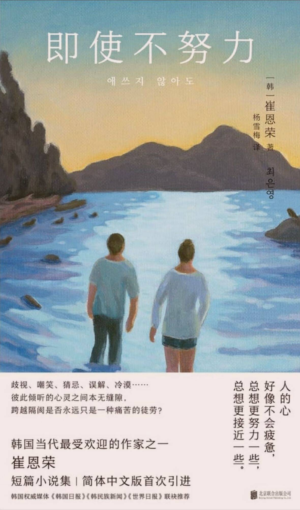
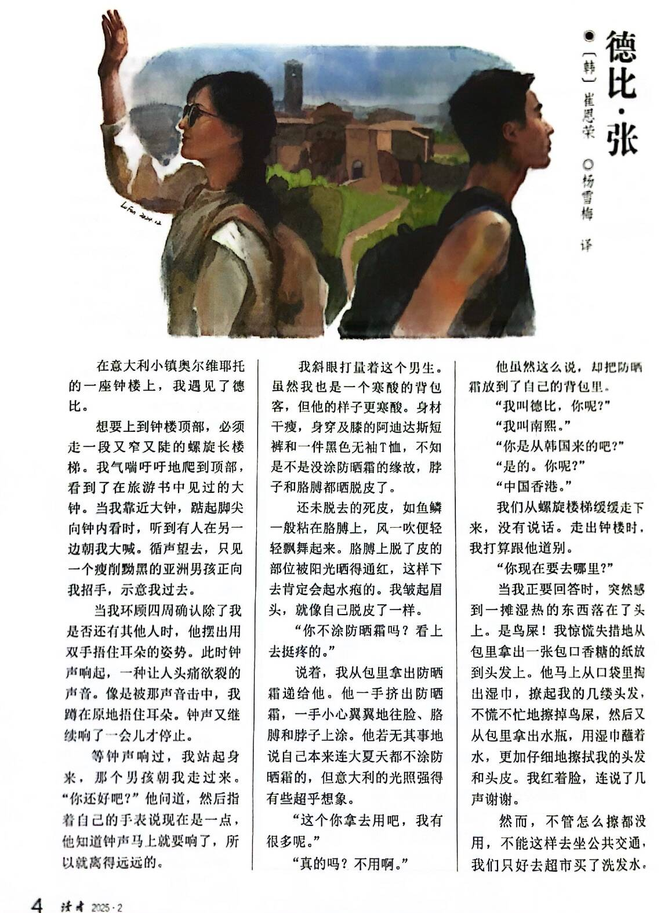
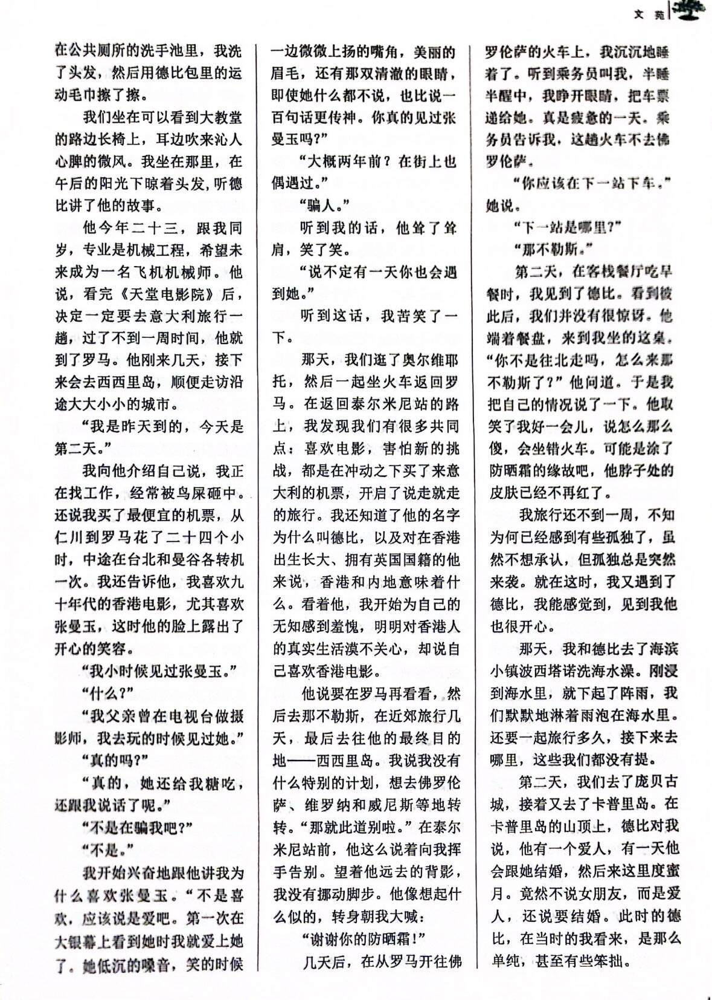
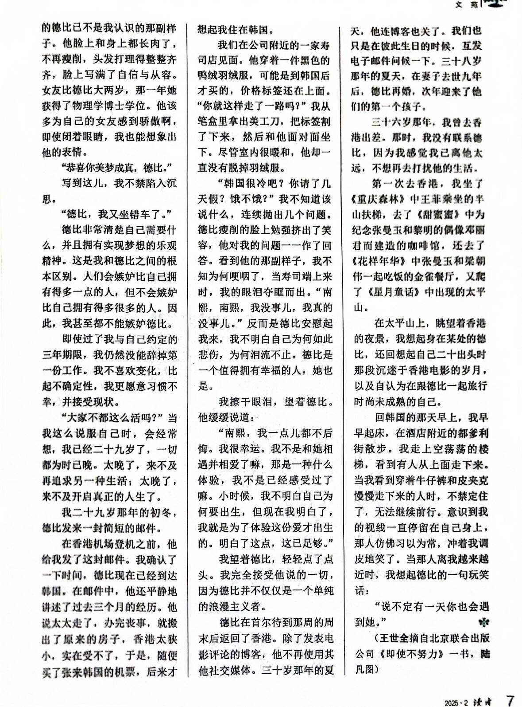

# 即使不努力

**短篇小说集**

结合当下韩国文学的流行趋势，那些尖锐的文字往往更易于被人们看到。人们，尤其是女性，迫切需要有人以一种残忍和尖刻的语言写出生活的苦难。崔恩荣的小说往往不会只写出苦难，她总是描写人的生活。在苦难的生活中，有好的人在存在着，他们有时候遇到好人，有时候遇到不好的人---这更倾向于描写一种感觉。   

## 只是描述一种感受
**生活中总是有一种不算痛苦但不能忘记的不上不下的情绪在关系中产生** 
**这些细小的感受被写了出来，组成了无数人的生活** 
【我仍然无法理解宥娜基于怎样的心态泄露了我的秘密，但我并不想把它归结为：她是个表里不一、无比狡猾的人，她有意想伤害我。不过，即便这是事实，即便宥娜不喜欢我，我想也是可以理解的。因为当时的我们会把爱和恨、羡慕和自卑、瞬间和永恒混为一谈，会认为“可以为之付出生命的人，同时也想对其施加伤害”这样的想法并不矛盾。
我以为自己将永远无法原谅，我以为不论我对宥娜是何种心意，它们一直都是那么夸张过度，不过现在的我，即使不努力，也会自然地想到宥娜，不带任何感情。也许我永远不会理解她，不过，我依然十分好奇：在宥娜的记忆中，我是什么样子的呢？她又会怎么想现在的我呢？】

## 用不传统的视角讨论稀松平常的、多样的关系
**母亲与孩子、两个偶遇的旅者、从小到大的朋友、相处了几个月的朋友、互相羡慕但不太熟的同学……**

【海珠的家人不能理解她，一个学识丰富的孩子怎么会信奉宗教，指责她是在浪费时间。家人劝她，有时间去那种地方，还不如去运动或读书，做些对自己有实际帮助的事情。每当听到这些话，海珠都会心中窃喜，她认为至少在信仰方面父母干涉不了她。从小她就很少按照自己的意愿做出过重大决定，上了父母让她上的补习班，读了父母让她读的书，父母认为女孩子应该当个老师，于是按照父母的意愿考了师范院校。今后的事情也显而易见，她会嫁给一个工作稳定的男人，大概会生两个孩子，因为这也是父母制订的计划。

不过，自从她有了信仰，她才意识到自己的心父母干涉不了，坐在安静的圣殿里，她领悟到自己也是一个有内心的独立存在，只有在那里她才能获得自由。也是在那时，她意识到自己的心如竹篮一样，任何东西都无法填满自己空虚的内心。无论舀多少水装入其中，竹篮般的内心都存不住一点儿水。接受上帝……体验上帝之爱，就如同不再往竹篮里装水，而是把竹篮扔进深水里。这是她不想和任何人分享的只属于她一个人的宝贵体验。这无法解释，也无法描述。至少对海珠来说，信仰是她最不想与人分享的私人领域。

上小学五年级时，侑莉说将来想成为神父。在以《我的梦想》为题的作文中，她还这么写道：“如果成为神父，就能更靠近上帝，我想为上帝做工，帮助困难的人。”为什么小孩会寻找上帝呢？只有十二岁的孩子怎么会有如此真挚的想法呢？无论怎么想，海珠都无法理解。
是不是因为我不是一个合格的大人，没能成为她的靠山，所以她才需要上帝呢？侑莉是个成熟懂事的孩子，她从不向海珠倾诉自己的辛苦。当海珠说爸爸妈妈离婚的事情，很对不起你时，记得当时只有十一岁的侑莉说：“不要考虑我，妈妈只考虑自己就好。”这是那个年龄的孩子可以说出的话吗？

怀上侑莉时，海珠希望孩子可以拥有自己的梦想，不希望她像自己那样为满足父母的欲望而失去追求梦想的自由。侑莉梦想成为一名神父，这个梦想现在已经成为过去。虽然小时候的梦想会发生改变，但因他人而非本人的意愿而放弃梦想的话，意义是不同的。海珠无法想象那会是一种什么样的伤害*

侑莉继续向前跑，没有放慢速度。看着渐行渐远的侑莉，海珠也加快了脚步。现在是海珠跟着侑莉奔跑的时候了】

## 淡淡的幸福感
**这本小说集是我在高三二模考试完的那个晚自习看完的。在全部是答案和分数的教室里，这些文字让我感到世界上还有和高考同时存在的东西，有人在没有高考的空间和时间里和我一样为即将到来的东西困扰。我感到被淡淡的幸福包围。**

【我想，成年之前是根部成长的时期。生长在什么样的土地上，当时的气候如何，都决定了根部的生长情况。如果土壤贫瘠，养分不足，无论种子再怎么努力，根系都不会粗壮。如果根部细弱的话，茎也会相应地变小变弱，这是它们的生存之道。只要过了那一时期，不管怎么努力，根部都不会再生长。即使是一阵微风，也会让它摇摆不定，难以支撑，总有种要被连根拔起的感觉。

“芬兰不是只有冬天。”

你对一直抱怨芬兰天气的我说道。到了七月，芬兰迎来春天。我们经常去我们村子附近的湖边玩。湖很大，沿着湖边走一段路，可以看到深林的入口。坐在和村子相邻的湖边，可以看到大湖被黑色的树林环绕着。即使到了最暖和的七月，湖边吹起风来，也会冷得让人抱紧胳膊。

我坐在铺着毛巾的地上看书，你穿着绿色的比基尼跳入湖里游泳。很多时候，除了你扑通扑通游泳的声音，我什么都听不到。四周静悄悄的，湖水和树林似乎把所有的声音都吸了进去。我不会游泳，也怕冷，所以只把脚泡在湖里，湖水很凉，连泡脚我都撑不了多久，在如此冰冷的湖水里你游了很久。从湖里出来，你用毛巾裹住身体，哆嗦着望向湖的另一边。
看着这样的你，我理解了为什么感觉和你相处很舒服，你又为什么会向我敞开心扉。我想抱一抱裹着毛巾蜷缩着身体的你。如果能用我的体温温暖一下你就好了，我想感受一下刚从水里出来的你身体有多冷。】

**书里有时候会出现像童话一样的体裁**

【他们让你遗忘和宽恕。当你说出“爱”时，他们以伦理道德为武器反对你。当你蹲下来哭泣，用尽全力进行反驳时，他们却对你的话打了个问号，根本没听进去。
你想，如果你有只大耳朵就好了，温暖地拥抱你的又大又柔软的耳朵，它可以倾听你那青肿的、流脓的话语。
你用力荡着秋千。
这里也不是没有痛苦，只是这里的痛苦是来自对他人的共情，是从他人的故事中体会到的痛苦。所以，你在这个世界还活着，以你本然的模样闪闪发光，如此美丽的你，在那个世界已消失的你。】

【我们很喜欢这种对话：如果可以重生的话，你想成为什么？我说过多次，我不想重生，但你一直追问。“鸟。”我回答，“听说北极上空有一种绕圈飞的鸟，我想成为那种鸟。店长你呢？”你说你想成为一棵树，还想成为一只长颈鹿，成为一条鳄鱼。“人生只有一次，世上每一种存在的生活，我都想尝试一遍。”“听着就觉得好痛苦。” 我说道。听完你爽快地笑了。
为什么你希望快点变老，重生一次后还要再次重生呢？我想问问你，你现在依然这么想吗？依然认为随着年龄的增长生活会变得平和，不会感觉那么痛了吗？】

## 柔和地接收不同的文化

**素食、宗教信仰都是韩国文化中多次被提到但我不常接触的概念。我不吃素、不信宗教，但是我们只是不同的人，我们在不同的信仰中也能找到共通与共鸣**

【成年后，酒桌上出现炸鸡时，人们会问她为什么不吃鸡肉，她会说自己对鸡肉过敏，因为不想破坏气氛。那么说的话，人们就会回答“原来如此”，就这样一笑而过。非常简单。在见到善雅之前她一贯这么解释。
善雅是她上大四时加入同一个社团的新生，在上大学之前，善雅工作过几年，和她同岁。那天善雅和她坐在同一张桌子上，善雅说：“啊，我不吃肉。”大家问及原因，她若无其事地回答：“因为知道了饲养的过程，所以吃不下。”坐在对面的同学说：“其他的都还好理解，但实在无法理解素食主义者。”善雅静静地看着那位同学，从容地笑了笑。】

## 德比张原文（我最喜欢的一篇）

**也许有一天你也会遇见她**

